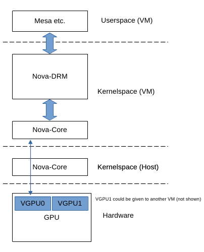

# Nova GPU Driver

Nova is a driver for GSP (global system processor) based Nvidia GPUs. It is
intended to become the successor of Nouveau as the mainline driver for Nvidia
(GSP) GPUs on Linux.

## Contact

Available communication channels are:

- The mailing list: nouveau@lists.freedesktop.org
- IRC: #nouveau on OFTC
- [Zulip Chat](https://rust-for-linux.zulipchat.com/#narrow/channel/509436-Nova)

## Resources

The parts that are already in mainline Linux can be found in
`drivers/gpu/nova-core/` and `drivers/gpu/drm/nova/`

The out-of-tree repository where active development takes place is located on
[Freedesktop](https://gitlab.freedesktop.org/drm/nova).

## Background

### Why a new driver?

Nouveau was, for the most part, designed for pre-GSP hardware. The driver exists
since ~2009 and its authors back in the day had to reverse engineer a lot about
the hardware's internals, resulting in a relatively difficult to maintain
codebase.

Moreover, Nouveau's maintainers concluded that a new driver, exclusively for
(new) GSP hardware, would allow for significantly simplifying the driver
design.

### Why write it in Rust?

Rust's most desired feature are its guarantees for memory safety, notably the
elimination of Use-after-Free errors. Those are errors GPU drivers suffer from
significantly, because GPUs are, by definition, asynchronous in regards to the
CPU and can handle millions of jobs (i.e., memory objects) simultaneously. Jobs'
status can be changed at different places in the code base at different
points in time (through work items, interrupt handlers, userspace calls, ...).

In short, GPU drivers were expected to profit the most from the promised memory
safety.

Since Nova was a freshly written new driver, it was an opportunity to try to
leverage the advantages of Rust and obtain a more reliable, maintainable driver.

Another reason is that Rust's macros are helpful when creating firmware bindings
for continuously changing firmware versions and their ABIs.

## Architecture

The overall GPU driver is split into two parts:

1. "Nova-Core", living in `linux/drivers/gpu/nova-core/`. Nova-Core implements
   the fundamental interaction with the hardware (through PCI etc.) and,
   notably, the firmware interfaces necessary to communicate with an Nvidia
   GPU.
2. "Nova-DRM" (the official name is actually just "Nova", but to avoid
   confusion developers usually call it "Nova-DRM"), living in
   `linux/drivers/gpu/drm/nova/`. This is the actual graphics driver,
   implementing all the typical DRM interfaces for userspace.

This split architecture allows for virtualizing GPUs: Nova-Core can be used to
instruct the GPU's firmware to spawn a new PCI subdevice, which can then be
passed to a virtual machine, which then, for example, can run another Linux
with another Nova-Core bound to the virtual GPU. Then, on top, Nova-DRM can
be utilized as a conventional GPU driver to use the GPU. This way, virtual
machines can get their own, dedicated virtual GPU which is not distinguishable
from a real, own physical GPU.

Of course, it is also possible to use Nova-Core + Nova-DRM on one physical
machine, then directly using the GPU through Mesa in the host's userspace.

## Status and Contributing

The necessary Rust infrastructure has been progressing a lot. Current work now
focusses more on the actual driver. In case you want to contribute, take a look
at the
[NOVA TODO List](https://docs.kernel.org/gpu/nova/core/todo.html).

Don't hesitate reaching out on the aforementioned community channels.
